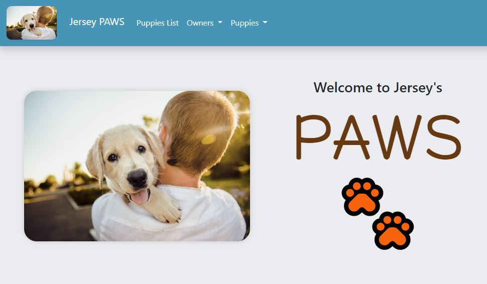

# Jersey PAWS - FLASK & SQLAlchemy (Python)

## Description

Jersey PAWS is a Python application coded with FLASK and SQLAlchemy frameworks. It allows the registration of owners who which to register their puppies. 

## Table of Contents

* [Usage](#usage)
* [Installation](#installation)
* [Where to Contribute](#where-to-contribute)
* [Repository](#repository)
* [Questions](#questions)
* [Screenshot](#screenshot)

## Usage

This Python application allows the user to navigate in a Web App with the following features:

* Retrieve a list of registered owners with their registered pets
* Register owners who would like to register their puppies
* After the owner has been registered, s/he can register their puppies

The code is build using classes to manage owners and dogs with their respective information. These are the following features.

### Owners

* Register name
* Add address, city, state and zipcode

### Puppies

* Register name
* How old each puppy is
* Height
* Color
* Favorite food

Should it be required, the user may upload a batch of data with the information to be appended to the database into the two tables coded: owner and pupppies.  Make sure that the batch files are stored in the same directory and saved as:

* owner_batch.csv
* puppies_batch.csv

If the user needs to see statistics of the owners and puppies added to the database, the following queries may be explore after running the queries.py file using your choice of CLI Anaconda Command Prompt, Terminal (Mac OS), Git Bash (Windows) or other CLI that supports Python (.py) and Jupyter Notebooks (.ipnyb). 

* Table with list of owners with attributes
* Table with list of puppies with attributes
* Amount of owners and puppies registered
* Amount of columns in owners and puppies tables
* Total puppies registered by owner
* Top favorite foods with totals
* Most popular colors with totals
* Table with the number of puppies within these age groups:

    * Less than 5 years old
    * Between 5 and 10 years old
    * More than 5 years old

## Installation

Clone the repository using your Git.

    git clone git@github.com:ivanzapatarivera/Python_Exercise_2.git

Create config.py with the following variables that run on your MySQL Workbench.

    username = 'root'
    password = 'password'
    port = 3306
    server = 'localhost'
    hostname = '127.0.0.1'
    database = 'database'
    auth_plugin='mysql_native_password'
    db_uri = f'mysql://{username}:{password}@{server}/{database}'

Using CLI (conda environment activated from Anaconda is required), run:

    On Mac OS:

        First time only: 
            set FLASK_APP=main.py 
            set FLASK_ENV=development
        
        Afterwards:
            python main.py
            start chrome http://127.0.0.1:5000/
    
    On Windows:

        First time only:
            export FLASK_APP=main.py
            export FLASK_ENV=development
        
        Afterwards:
            python main.py
            start chrome http://127.0.0.1:5000/

To load your first batch of data stored in current directory run the following command on CLI (Mach OS and Windows):

    python batch.py

## Where to Contribute

Contribution requests may be sent to:

* Email: [ivan.zapata-rivera@gmail.com](mailto:ivan.zapata-rivera@gmail.com)
* LinkedIn: [Ivan J. Zapata-Rivera: linkedin.com/in/ivanzapatarivera/](https://www.linkedin.com/in/ivanzapatarivera/)

## Repository

GitHub Title: [Python_Exercise_2: github.com/ivanzapatarivera/Python_Exercise_2](https://github.com/ivanzapatarivera/Python_Exercise_2)

## Screenshot

